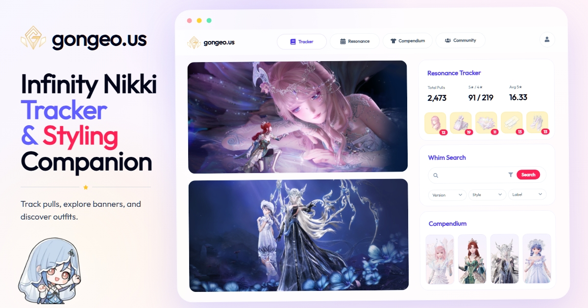

# gongeo.us - Infinity Nikki Resonance Tracker

[简体中文](./README.zh-CN.md)

A fan-made web app for tracking Infinity Nikki resonance history, banner stats, and community insights.

## Links

- **Website**: [gongeo.us](https://gongeo.us)
- **Discord**: [Join our community](https://discord.gg/qymsW3j4Zw)
- **Ko-fi**: [Support the project](https://ko-fi.com/gongeous)
- **X/Twitter**: [Follow for updates](https://x.com/gongeo_us)

## Tech Stack

- [Nuxt 4](https://nuxt.com/) - Vue.js framework
- [Vue 3](https://vuejs.org/) - JavaScript framework
- [Naive UI](https://www.naiveui.com/) - Vue component library
- [Tailwind CSS](https://tailwindcss.com/) - Utility-first CSS framework
- [Pinia](https://pinia.vuejs.org/) - State management
- [Nuxt i18n](https://i18n.nuxtjs.org/) - Internationalization
- [Supabase](https://supabase.com/) - Backend and authentication
- [ECharts](https://echarts.apache.org/) - Data visualization

## License

This project is a fan-made tool and is not affiliated with Infinity Nikki, Infold Games, or related official entities. All game assets, names, and trademarks belong to their respective owners.
