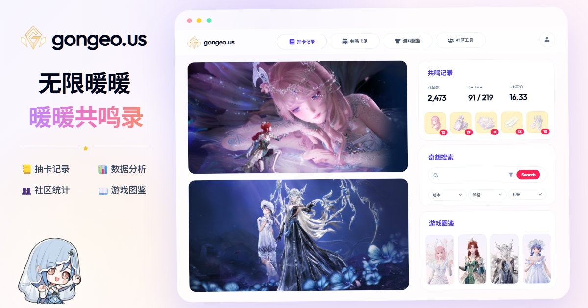

# gongeo.us - 无限暖暖共鸣记录与数据工具

[English](./README.md)

一个为《无限暖暖》玩家制作的非官方网页工具，可用于记录共鸣历史、查看卡池数据和了解社区统计趋势。

## 相关链接

- **网站**: [gongeo.us](https://gongeo.us/zh)
- **Discord**: [加入社区](https://discord.gg/qymsW3j4Zw)
- **Ko-fi**: [支持项目](https://ko-fi.com/gongeous)
- **X/Twitter**: [关注更新](https://x.com/gongeo_us)

## 技术栈

- [Nuxt 4](https://nuxt.com/) - Vue.js 框架
- [Vue 3](https://vuejs.org/) - JavaScript 框架
- [Naive UI](https://www.naiveui.com/) - Vue 组件库
- [Tailwind CSS](https://tailwindcss.com/) - 原子化 CSS 框架
- [Pinia](https://pinia.vuejs.org/) - 状态管理
- [Nuxt i18n](https://i18n.nuxtjs.org/) - 国际化
- [Supabase](https://supabase.com/) - 后端与身份认证
- [ECharts](https://echarts.apache.org/) - 数据可视化

## 许可

本项目是由玩家制作的非官方工具，与《无限暖暖》、叠纸游戏、Infold Games 或相关官方主体无关。所有游戏素材、名称及商标均归其各自权利方所有。
